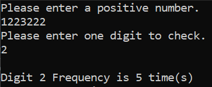

# Problem Solving in C++ - Level 2

Welcome to my C++ problem-solving repository! In this repository, I solve various algorithmic problems to enhance my programming skills in C++. Each problem is stored in its own directory, and this README will describe each of the exercises.

## Exercise 1: Multiplication Table Generator (1 to 10)

### Problem Statement:

The task is to create a program that generates and displays a multiplication table for numbers 1 to 10 in a well-formatted manner. The table should display the multiplication of each number from 1 to 10 with every other number in the range.

### Output:

Below is an example of the output of the multiplication table generated by the program:

## Exercise 2: Prime Numbers from 1 to N

### Problem Statement:

The task is to create a program that generates and prints all prime numbers in the range from 1 to a user-specified number N.

### Output:

Below is an example of the output of the program:

## Exercise 3: Perfect Number Checker

### Problem Statement:

The task is to create a program that checks whether a given number is a perfect number or not. A perfect number is a positive integer that is equal to the sum of its proper divisors, excluding itself. For example, 6 is a perfect number because its divisors (1, 2, 3) sum up to 6.

### Output:

Below is an example of the output of the program:

## Exercise 4: Perfect Numbers from 1 to N

### Problem Statement:

The task is to create a program that generates and prints all perfect numbers in the range from 1 to a user-specified number N.

### Output:

Below is an example of the output of the program:

## Exercise 5: Reverse Digits of a Number

### Problem Statement:

The task is to create a program that reads a positive number from the user and prints its digits in reverse order. The program should prompt the user to input a number, and then print each digit of the number starting from the least significant (rightmost) digit to the most significant (leftmost) digit.

### Approach

There are two approaches to reversing the digits of a number:

1- the first method converts the integer to a string, allowing easy access to each digit in reverse order by iterating over the string from last to first.

2- The second method uses mathematical operations, repeatedly dividing the number by 10 to extract each digit via modulus,

### Output:

Below is an example of the output of the program:

## Exercise 6: Sum of digits

### Problem Statement:

The task is to create a program that reads a positive number from the user and prints the sum of its digits.

### Output:

Below is an example of the output of the program:

## Exercise 7: Reverse a Number

### Problem Statement:

The task is to create a program that reads a positive integer from the user and returns the number with its digits reversed.

### Output:

Below is an example of the output of the program:

## Exercise 8: Count Digit Frequency

### Problem Statement:

The task is to create a program that reads a number and a digit from the user and returns the digit frequency in that number.

### Output:

Below is an example of the output of the program:

## Exercise 9: Count All Digits Frequency

### Problem Statement:

The task is to create a program that reads a number from the user and returns all digits frequency in that number.

### Output:

Below is an example of the output of the program:

## Exercise 10: Reversed Digit Display

### Problem Statement:

The task is to create a program that reads a number from the user and returns it in order from left to right

### Output:

Below is an example of the output of the program:

## Exercise 11: Palindrome Number Checker

### Problem Statement:

The task is to create a program that reads a number from the user and returns if it is a Palindrome number or not.
A palindrome number is a number that reads the same forward and backward. In other words, its digits are symmetrical

### Output:

Below is an example of the output of the program:

## Exercise 12: Print Inverted Number Pattern

### Problem Statement:

This program prompts the user for a positive integer and prints an inverted number pattern, where each row contains the same digit and the number of digits decreases with each row.

### Output:

Below is an example of the output of the program:

## Exercise 13: Print Number Pattern

### Problem Statement:

This program prompts the user for a positive integer and prints a number pattern where each row contains the same digit, and the number of digits in each row increases as you move down.

### Output:

Below is an example of the output of the program:

## Exercise 14: Inverted Alphabet Pattern Generator

### Problem Statement:

This program prompts the user for a positive integer and program that generates an inverted letter pattern based on a user-input digit and displays a series of characters, where each line consists of a repeated character corresponding to the current row number in reverse order, starting with the character corresponding to the letter for the input number.

### Output:

Below is an example of the output of the program:

## Exercise 15: Alphabet Pattern Generator

### Problem Statement:

This program prompts the user for a positive integer and program that generates a letter pattern based on a user-input digit and displays a series of characters, where each line consists of a repeated character corresponding to the current row number in order, starting with the character corresponding to the letter for the input number.

### Output:

Below is an example of the output of the program:

