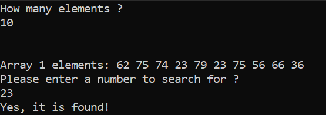
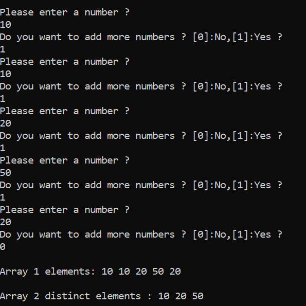
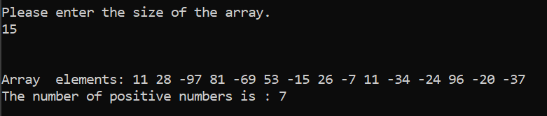

# Problem Solving in C++ - Level 2

Welcome to my C++ problem-solving repository! In this repository, I solve various algorithmic problems to enhance my programming skills in C++. Each problem is stored in its own directory, and this README will describe each of the exercises.

## Exercise 1: Multiplication Table Generator (1 to 10)

### Problem Statement:

The task is to create a program that generates and displays a multiplication table for numbers 1 to 10 in a well-formatted manner. The table should display the multiplication of each number from 1 to 10 with every other number in the range.

### Output:

Below is an example of the output of the multiplication table generated by the program:

## Exercise 2: Prime Numbers from 1 to N

### Problem Statement:

The task is to create a program that generates and prints all prime numbers in the range from 1 to a user-specified number N.

### Output:

Below is an example of the output of the program:

## Exercise 3: Perfect Number Checker

### Problem Statement:

The task is to create a program that checks whether a given number is a perfect number or not. A perfect number is a positive integer that is equal to the sum of its proper divisors, excluding itself. For example, 6 is a perfect number because its divisors (1, 2, 3) sum up to 6.

### Output:

Below is an example of the output of the program:

## Exercise 4: Perfect Numbers from 1 to N

### Problem Statement:

The task is to create a program that generates and prints all perfect numbers in the range from 1 to a user-specified number N.

### Output:

Below is an example of the output of the program:

## Exercise 5: Reverse Digits of a Number

### Problem Statement:

The task is to create a program that reads a positive number from the user and prints its digits in reverse order. The program should prompt the user to input a number, and then print each digit of the number starting from the least significant (rightmost) digit to the most significant (leftmost) digit.

### Approach

There are two approaches to reversing the digits of a number:

1- the first method converts the integer to a string, allowing easy access to each digit in reverse order by iterating over the string from last to first.

2- The second method uses mathematical operations, repeatedly dividing the number by 10 to extract each digit via modulus,

### Output:

Below is an example of the output of the program:

## Exercise 6: Sum of digits

### Problem Statement:

The task is to create a program that reads a positive number from the user and prints the sum of its digits.

### Output:

Below is an example of the output of the program:

## Exercise 7: Reverse a Number

### Problem Statement:

The task is to create a program that reads a positive integer from the user and returns the number with its digits reversed.

### Output:

Below is an example of the output of the program:

## Exercise 8: Count Digit Frequency

### Problem Statement:

The task is to create a program that reads a number and a digit from the user and returns the digit frequency in that number.

### Output:

Below is an example of the output of the program:

## Exercise 9: Count All Digits Frequency

### Problem Statement:

The task is to create a program that reads a number from the user and returns all digits frequency in that number.

### Output:

Below is an example of the output of the program:

## Exercise 10: Reversed Digit Display

### Problem Statement:

The task is to create a program that reads a number from the user and returns it in order from left to right

### Output:

Below is an example of the output of the program:

## Exercise 11: Palindrome Number Checker

### Problem Statement:

The task is to create a program that reads a number from the user and returns if it is a Palindrome number or not.
A palindrome number is a number that reads the same forward and backward. In other words, its digits are symmetrical

### Output:

Below is an example of the output of the program:

## Exercise 12: Print Inverted Number Pattern

### Problem Statement:

This program prompts the user for a positive integer and prints an inverted number pattern, where each row contains the same digit and the number of digits decreases with each row.

### Output:

Below is an example of the output of the program:

## Exercise 13: Print Number Pattern

### Problem Statement:

This program prompts the user for a positive integer and prints a number pattern where each row contains the same digit, and the number of digits in each row increases as you move down.

### Output:

Below is an example of the output of the program:

## Exercise 14: Inverted Alphabet Pattern Generator

### Problem Statement:

This program prompts the user for a positive integer and program that generates an inverted letter pattern based on a user-input digit and displays a series of characters, where each line consists of a repeated character corresponding to the current row number in reverse order, starting with the character corresponding to the letter for the input number.

### Output:

Below is an example of the output of the program:

## Exercise 15: Alphabet Pattern Generator

### Problem Statement:

This program prompts the user for a positive integer and generates a letter pattern based on a user-input digit and displays a series of characters, where each line consists of a repeated character corresponding to the current row number in order, starting with the character corresponding to the letter for the input number.

### Output:

Below is an example of the output of the program:

## Exercise 16: All Combinations of Three Uppercase Letters generator

### Problem Statement:

This program prompts the user for a positive integer and prints all possible combinations of three uppercase letters from the English alphabet, where each letter can be any of the 26 uppercase letters ('A' to 'Z'). Each combination of three letters should be printed on a new line (AAA ... ZZZ);

### Output:

Below is an example of the output of the program:

## Exercise 17: Three-Letter Password Guesser

### Problem Statement:

This program guesses a three-letter uppercase password by generating all possible combinations of letters (from "AAA" to "ZZZ"). It compares each guess with the user's input and outputs the correct password along with the number of attempts needed to find it.

### Output:

Below is an example of the output of the program:

## Exercice 18 : Word Encryption and Decryption

### Problem Statement:

This program allows the user to input a word, then encrypts and decrypts the word by shifting the ASCII values of its characters. The program then displays the encrypted word followed by the decrypted word.

### Output:

Below is an example of the output of the program:

## Exercice 20 : Random Character Generator

### Problem Statement:

This program generates and displays a random number respecting a specified range;

### Output:

Below is an example of the output of the program:

## Exercice 20 : Random Character Generator Based on Enum Types

### Problem Statement:

This program generates and displays one random character from each of the following categories: lowercase letter (a-z), uppercase letter (A-Z), special character (ASCII values 32-47), and digit (0-9). It uses an enum to represent these categories and a random number generator to select and print a character from each category.

### Output:

Below is an example of the output of the program:

## Exercice 21 : Key Generation System with Customizable Length and Format

### Problem Statement:

This program generates a series of alphanumeric keys in a predefined format. Each key consists of four segments, with each segment containing four random uppercase letters separated by hyphens (e.g., XXXX-XXXX-XXXX-XXXX). The number of keys to generate is specified by the user at runtime, and the program ensures randomness by selecting uppercase letters for each segment.

### Output:

Below is an example of the output of the program:

## Exercice 22 : Digit Frequency Counter in an Array

### Problem Statement:

This program allows the user to input the length of an array and then enter the elements of the array. After displaying the array, the program prompts the user to input a number. It then counts and displays how many times the specified number appears in the array.

### Output:

Below is an example of the output of the program:

## Exercice 23 : Random Array Generator with User-Defined Length

### Problem Statement:

The program prompts the user to input the array length (with a maximum size of 100) and then fills the array with random numbers ranging from 1 to 100.

### Output:

Below is an example of the output of the program:

## Exercice 24 : Random Array Population and Maximum Number Detection

### Problem Statement:

The program prompts the user to input the array length (with a maximum size of 100), fills the array with random numbers between 1 and 100, and then displays the array along with the maximum value from the generated numbers.

### Output:

Below is an example of the output of the program:

## Exercice 26 : Sum Array Numbers

### Problem Statement:

The program prompts the user to input the array length (with a maximum size of 100), fills the array with random numbers between 1 and 100, and then displays the array along with the sum value of all array 's numbers.

### Output:

Below is an example of the output of the program:

## Exercice 27 : Average Array Numbers

### Problem Statement:

The program prompts the user to input the array length (with a maximum size of 100), fills the array with random numbers between 1 and 100, and then displays the array along with the average value of all array 's numbers.

### Output:

Below is an example of the output of the program:

## Exercice 28 : Copying Random Array Values to a Second Array

### Problem Statement:

The program prompts the user to input the length of an array (with a maximum size of 100). It then fills the array with random numbers between 1 and 100. Afterward, the program creates a second array and copies the values from the first array into it. Finally, the program displays both the original and the copied arrays to the user.

### Output:

Below is an example of the output of the program:

## Exercice 29 : Copying Only Prime Numbers From Random Array Values to a Second Array

### Problem Statement:

The program prompts the user to enter the length of an array (up to a maximum size of 100). It then populates the array with random integers between 1 and 100. After that, the program creates a second array and copies only the prime numbers from the first array into the second array. Finally, the program displays both the original array (with all the random numbers) and the second array (containing only the prime numbers) to the user.

### Output:

Below is an example of the output of the program:

## Exercice 30 : Sum of 2 Arrays

### Problem Statement:

The program first prompts the user to input the desired length of an array, which can be up to a maximum of 100 elements. It then generates two arrays, each filled with random integers between 1 and 100. Afterward, a third array is created, where each element is the sum of the corresponding elements from the first two arrays. Finally, the program displays the original arrays showing all the generated random numbers and the third array, which contains the summed values from the first two arrays.

### Output:

Below is an example of the output of the program:

## Exercice 31 : Array Elements Shuffler

### Problem Statement:

The program begins by prompting the user to enter the desired length of an array, with a maximum of 100 elements. It then generates an array where each element corresponds to its index, starting from 1. Afterward, the program shuffles the array elements randomly. Finally, the program displays both the original and shuffled arrays.

### Output:

Below is an example of the output of the program:

## Exercice 32 : Copy Array in Reverse Order

### Problem Statement:

The program prompts the user to input the length of an array (up to a maximum size of 100). It then fills the array with random numbers between 1 and 100. Next, the program creates a second array and copies the values from the first array into the second, but in reverse order. Finally, it displays both the original and the reversed arrays to the user.

### Output:

Below is an example of the output of the program:

## Exercice 33 : Fill Array with Randomly Generated Keys

### Problem Statement:

This program prompts the user to enter the number of random keys to generate. Each key consists of four groups of four uppercase letters, separated by hyphens (e.g., ABCD-EFGH-IJKL-MNOP). The keys are stored in an array, and the program then displays the array of generated keys.

### Output:

Below is an example of the output of the program:

## Exercice 34 : Find Digit Position In An Array

### Problem Statement:

The program generates an array of random integers and allows the user to specify the size of the array and a target number to search for. It then searches the array for the target number, reporting its position if found or indicating that the number is not present.

### Output:

Below is an example of the output of the program:

## Exercice 35 : Find Digit In An Array

### Problem Statement:

The program generates an array of random integers and allows the user to specify the size of the array and a target number to search for. It then searches the array for the target number, reporting if it is found or not.

### Output:

Below is an example of the output of the program:

## Exercice 36 :Semi-Dynamic Array Input for Positive Numbers

### Problem Statement:

This program allows the user to input positive numbers and stores them in a semi-dynamic array, where the user can decide whether to add more numbers after each entry. The process continues until the user chooses not to add more numbers or the array reaches its maximum size of 100 elements.

### Output:

Below is an example of the output of the program:

## Exercice 37 : A More Efficient Approach to Solving Exo28

### Problem Statement:

The program begins by prompting the user to enter the desired length of an array, with a maximum size of 100 elements. It then populates the array with random numbers ranging from 1 to 100. Next, the program creates a second array and copies the values from the first array into it. Finally, both the original and the copied arrays are displayed to the user.

### Note :

This is the Exo28 problem, but with more efficient and refined solution.

### Output:

Below is an example of the output of the program:

## Exercice 38 : Copying Only Odd Numbers From Random Array Values to a Second Array

### Problem Statement:

The program prompts the user to enter the length of an array (up to a maximum size of 100). It then populates the array with random integers between 1 and 100. After that, the program creates a second array and copies only the odd numbers from the first array into the second array. Finally, the program displays both the original array (with all the random numbers) and the second array (containing only the odd numbers) to the user.

### Output:

Below is an example of the output of the program:

## Exercice 39 : A More Efficient Approach to Solving Exo29

### Problem Statement:

The program prompts the user to enter the length of an array (up to a maximum size of 100). It then populates the array with random integers between 1 and 100. After that, the program creates a second array and copies only the prime numbers from the first array into the second array. Finally, the program displays both the original array (with all the random numbers) and the second array (containing only the prime numbers) to the user.

### Note :

This is the Exo29 problem, but with more efficient and refined solution.

### Output:

Below is an example of the output of the program:

## Exercice 40 : Creating an Array of Distinct Elements from A One Based on User Input

### Problem Statement:

The program allows the user to input a series of positive integers and stores them in an array. It then creates a second array that contains only the distinct values from the first array, removing any duplicates while preserving the original order.

### Output:

Below is an example of the output of the program:

## Exercice 41 : Palindrome Array Checker

### Problem Statement:

the program checks whether an array of integers is a palindrome.

### Output:

Below is an example of the output of the program:

## Exercice 42 : Odd Numbers in Array Counter

### Problem Statement:

The program for counts the number of odd numbers in an array of integers.

### Output:

Below is an example of the output of the program:

## Exercice 43 : Even Numbers in Array Counter

### Problem Statement:

The program for counts the number of even numbers in an array of integers.

### Output:

Below is an example of the output of the program:

## Exercice 44 : Positive Numbers in Array Counter

### Problem Statement:

The program for counts the number of positive numbers in an array of integers.

### Output:

Below is an example of the output of the program:

## Exercice 45 : Negative Numbers in Array Counter

### Problem Statement:

The program for counts the number of negative numbers in an array of integers.

### Output:

Below is an example of the output of the program:

## Exercice 46 :Absolute Value Calculation: Custom vs Built-in Function

### Problem Statement:

The program prompts the user to enter a number and calculates its absolute value using a custom myABS function. It then compares the result with the built-in abs function and displays both results for comparison.

### Output:

Below is an example of the output of the program:

